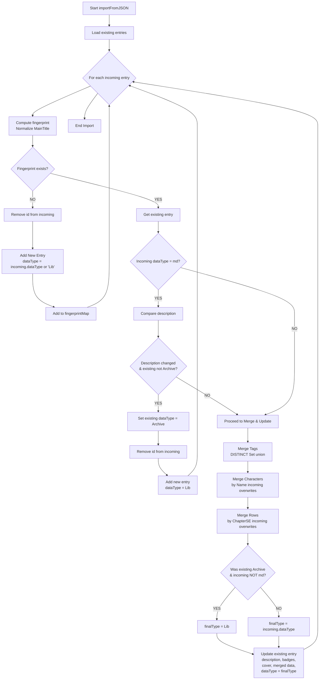

```mermaid
flowchartdata TD

	A[Main Source Realtime<br/>dataType = jsonDb] --> C(MIX)
	B[Main Source Realtime<br/>dataType = md] --> C

	C --> D{Match Exists?<br/>IF dataType=jsonDb DO -Normalize Title: Strip Symbols + Lowercase;; IF dataType=Md do both Title, AlternativeTitles}

	%% NO MATCH
	D -->|NO| N1[Add New Entry<br/>dataType = Lib]

	%% MATCH
	D -->|YES| E{DataType Matches?}

	%% DataType MATCH
	E -->|YES| F{Description Matches?}

	%% Desc MATCH
	F -->|YES| U1[Update description & badges<br/>DISTINCT merge:<br/>tags, characters-mergeByName, rows-mergeByChapterSE]

	%% Desc DIFFER
	F -->|NO| T1{Incoming dataType?}

	T1 -->|jsonDb| U2[Update description & badges<br/>DISTINCT merge:<br/>tags, characters-mergeByName, rows-mergeByChapterSE]
	T1 -->|md| A1[Set existing <br/>dataType = Archive<br/>Add new entry]

	%% DataType NOT MATCH
	E -->|NO| T2{Incoming dataType?}

	T2 -->|md| A2[Set existing <br/>dataType = Archive<br/>Add new entry]
	T2 -->|jsonDb| U3[Update description & badges<br/>DISTINCT merge:<br/>tags, characters-mergeByName, rows-mergeByChapterSE]
```

